# Виконане домашнє завдання, CRUD операці в Postman
## представленно рішення для 3-х варіантів. Та відповіді на контрольні запитання в кінці файлу

# ВАРІАНТ 1

PUT запит (CREATE):
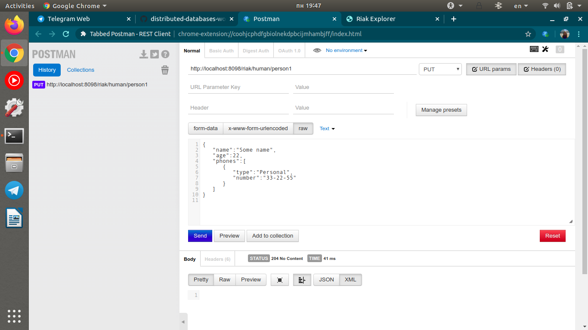

GET запит (перевірка відправки даних) (READ):
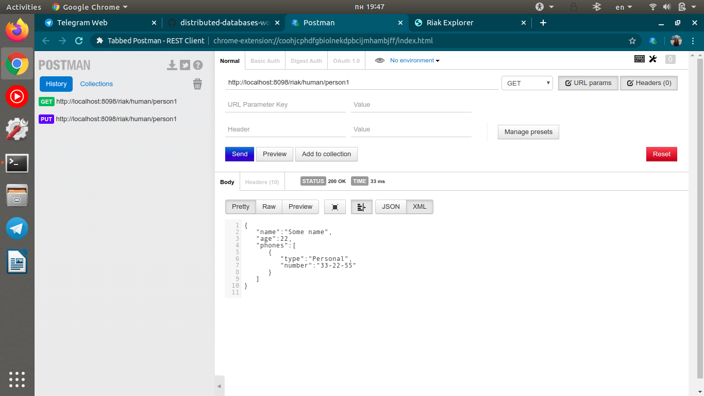

GET запит з перевіркою ключів:
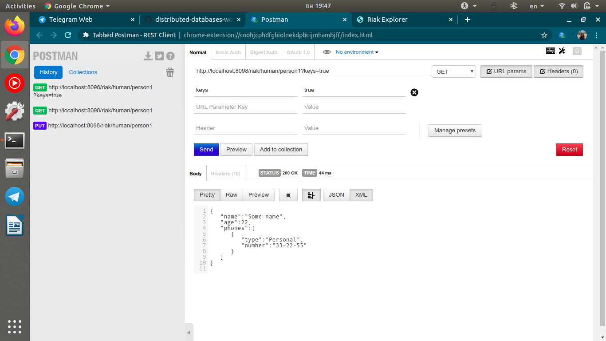

PUT запит з оновленням інформації в тілі (UPDATE)
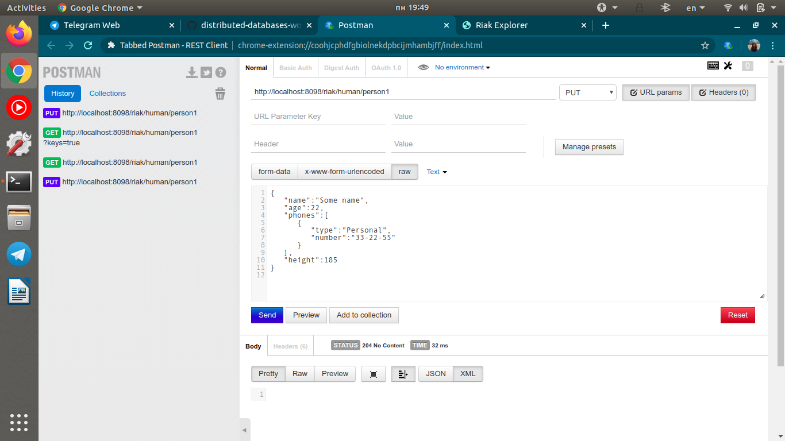

GET запит (перевірка оновлення даних) (READ):
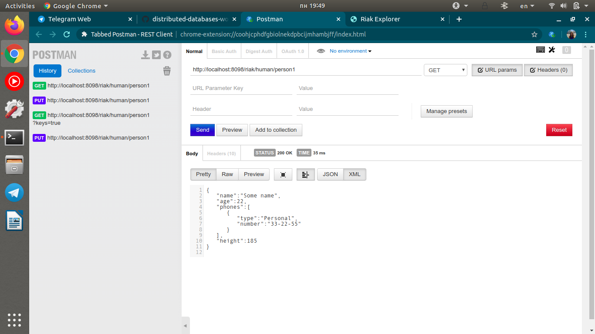

DELETE 
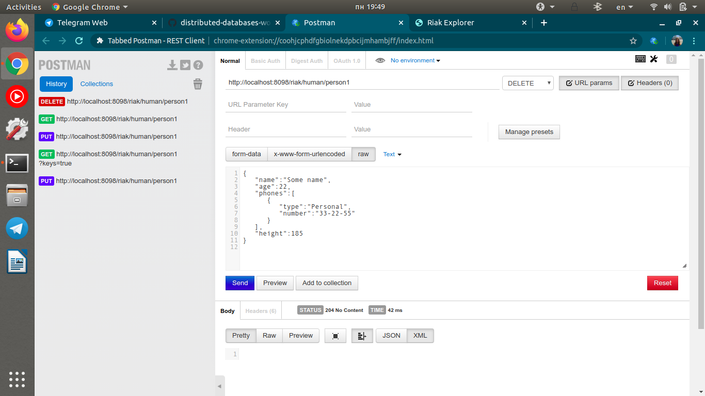

GET запит для перевірки видалення
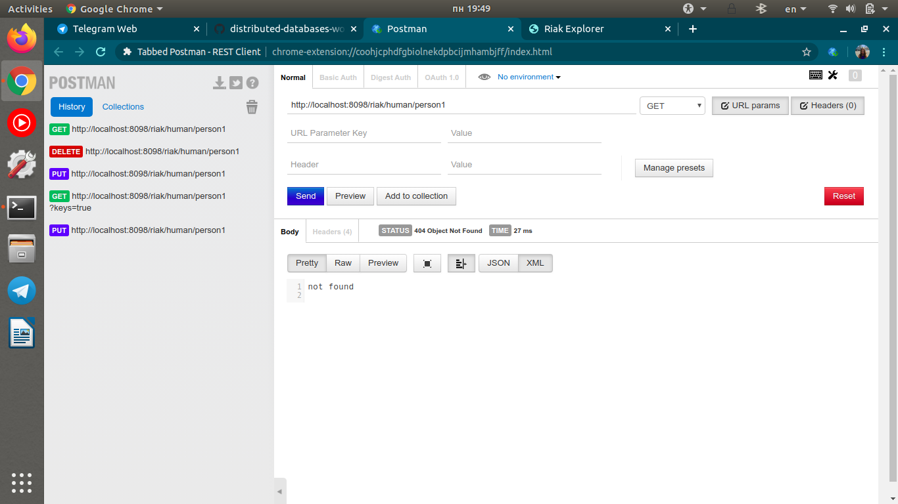

# ВАРІАНТ 2

PUT запит (CREATE):

GET запит (перевірка відправки даних) (READ):
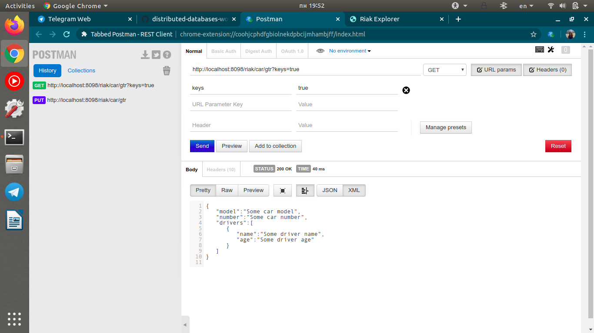

PUT запит з оновленням інформації в тілі (UPDATE)
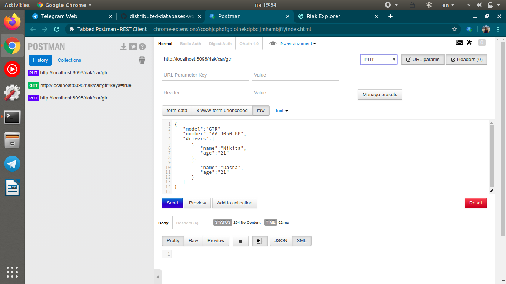

GET запит (перевірка оновлення даних) (READ):
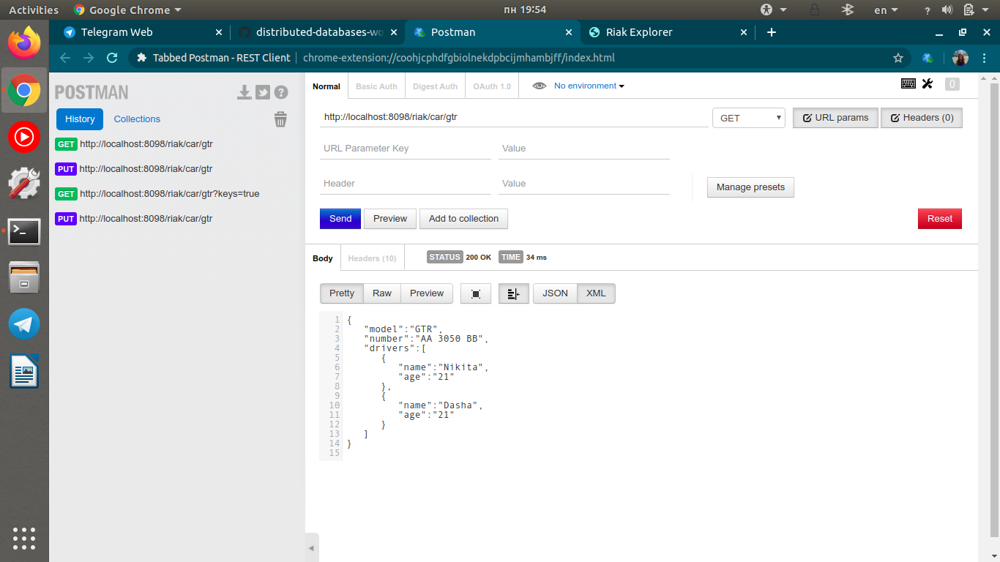

DELETE 
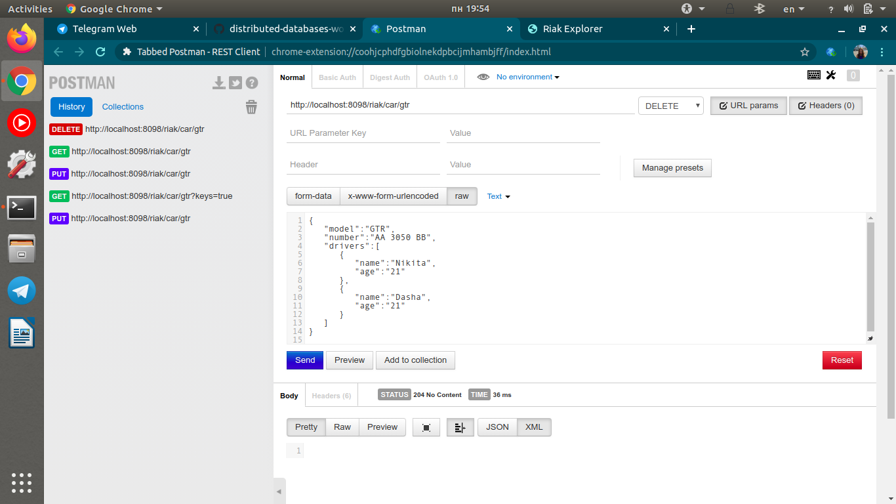

# ВАРІАНТ 3

PUT запит (CREATE):
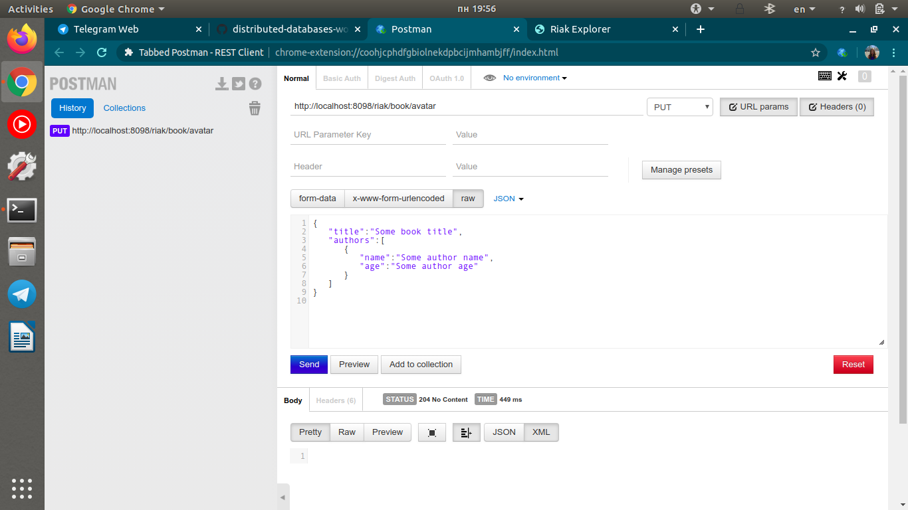

GET запит (перевірка відправки даних) (READ):
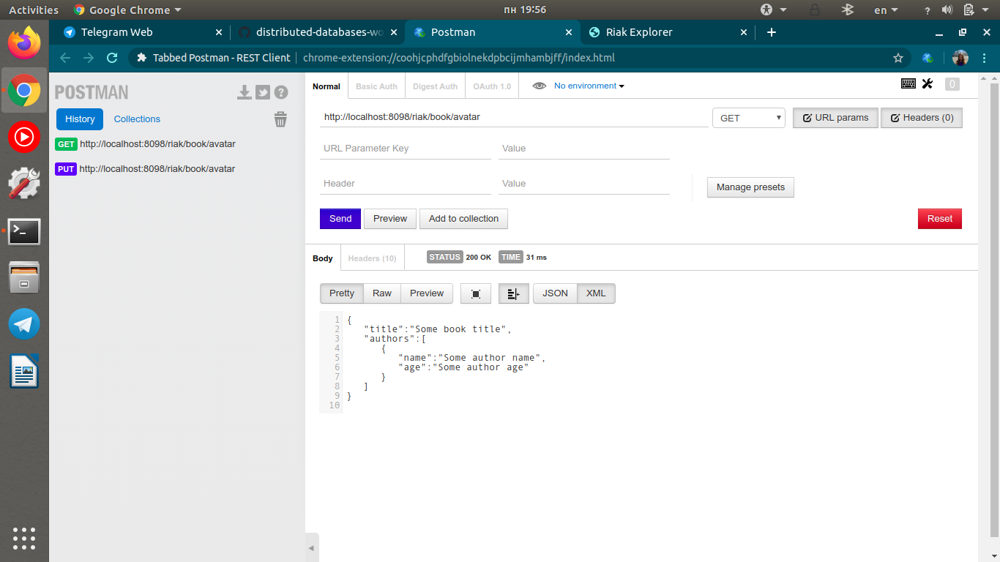

PUT запит з оновленням інформації в тілі (UPDATE)
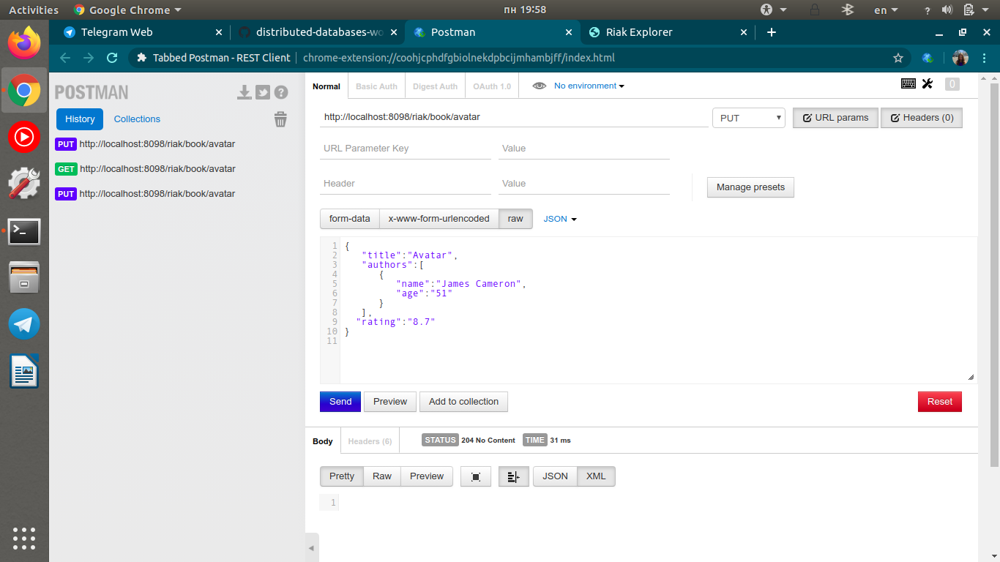

GET запит (перевірка оновлення даних) (READ):
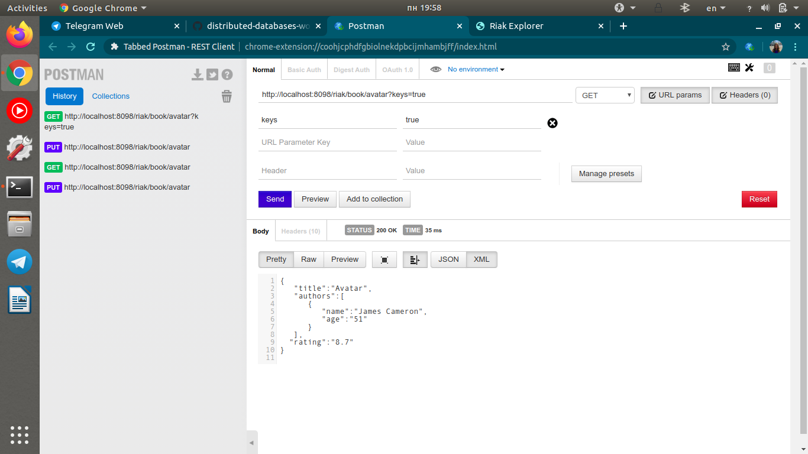

DELETE 
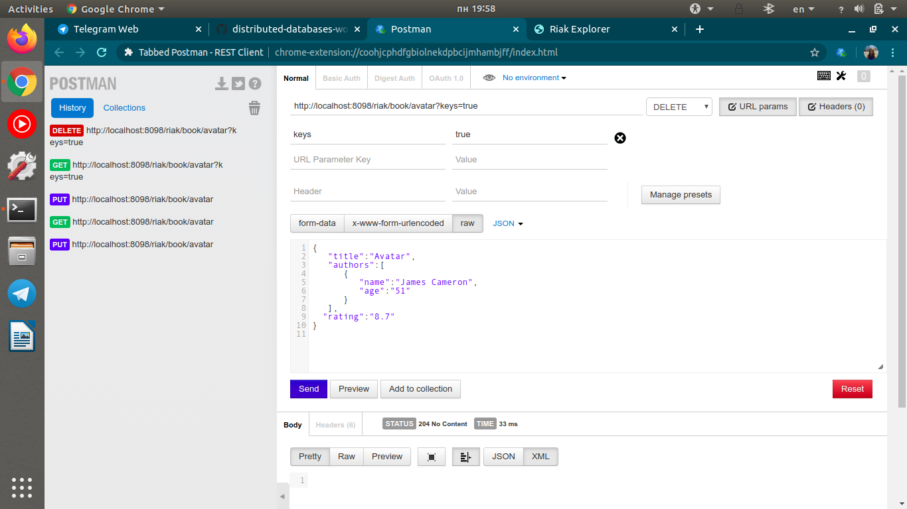

GET запит для перевірки видалення

# Відповіді на контрольні запитання

1. Що таке Riak?

Riak - вільна горизонтально масштабована NoSQL-система, розроблена компанією Basho Technologies.
Riak - це децентралізоване key-value сховище даних, з підтримкою стандартних операцій - get, put і delete. Riak - це рішення для зберігання інформації,  розподілене та здатне до масштабуваннz. А також Riak - це система з відкритим вихідним кодом і підтримкою звернень за допомогою HTTP, JSON і REST

2. Яку модель використовує Riak?

Модель ключ-значення

3. Як отримати запис із Riak?

Запитом GET

4. Як додати запис в Riak?

За допомогою PUT - запиту

5. Як модифікувати запис в Riak?

Також за допомогою PUT

6. Як видалити запис в Riak?

DELETE - запитом
