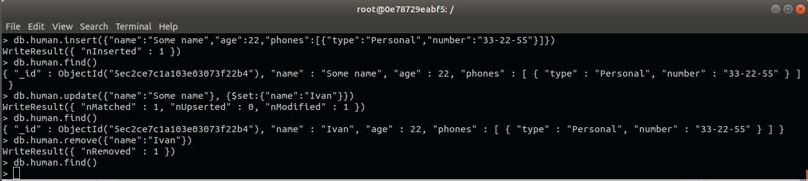

# Виконане домашнє завдання, CRUD операці в Mongo
### представленно рішення для 3-х варіантів. Та відповіді на контрольні запитання в кінці файлу

CRUD - операції JSON - схемою для 1-го варіанту:

CRUD - операції JSON - схемою для 2-го варіанту:

CRUD - операції JSON - схемою для 3-го варіанту:

# Відповіді на контрольні запитання

1. Що таке MongoDB?

MongoDB - документоорієнтована система управління базами даних з відкритим вихідним кодом, яка не потребує опису схеми таблиць. Класифікована як NoSQL, використовує JSON-подібні документи і схему бази даних. Це крос-платформна база даних, яка забезпечує високу продуктивність і легку масштабованість. В основі даної БД лежить концепція колекцій і документів.

2. Яку модель використовує MongoDB?

MongoDB використовує нереляційну модель баз даних

3. Як додати запис в БД?

Щоб додати запис до колекції можна скористатись трьома методами:

 * insertOne (): додає один документ
 * insertMany (): додає кілька документів
 * insert (): може додавати як один, так і кілька документів

4. Як знайти запис в БД?

За допомогою функції 
> db.users.find()

5. Як модифікувати запис в БД? Для чого використовується модифікатор $set?

ФДля модифікації записів користуються функцією update(criteria, operation), яка приймає два обов’язкових параметра. Перший - критерій відбору - такий же, як для функції find(). Другий - або об'єкт, поля якого замінюють поля відібраних документів, або модифікатор. 
$set записує вказане значення у вказане поле.

6. Як видалити запис із БД?

Скористатись функцією remove()