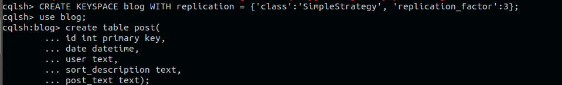
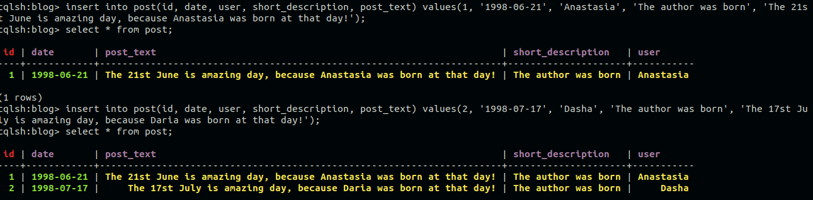
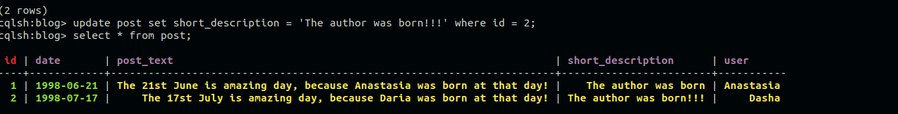
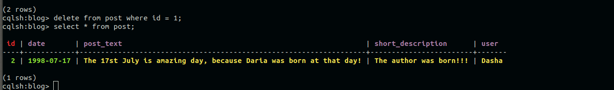
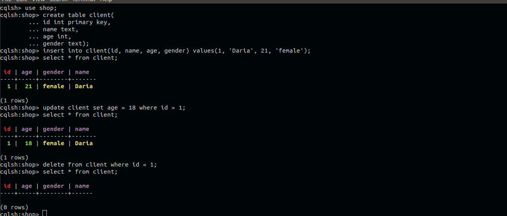
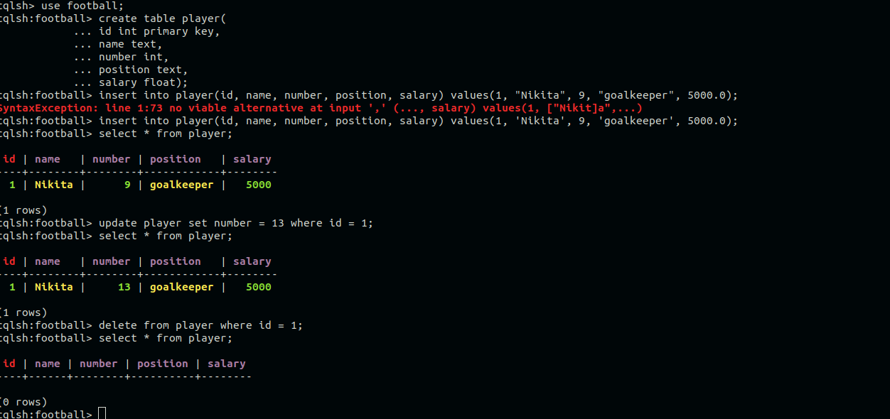

# Виконане домашнє завдання, cтворіть таблицю згідно із варіантом і виконайте CRUD - операції
### представленно рішення для 3-х варіантів

Перший варіант

keyspace = blog

CREATE and READ

UPDATE and READ

DELETE and READ

## Другий варіант

keyspace = shop

## Другий варіант

keyspace = football

