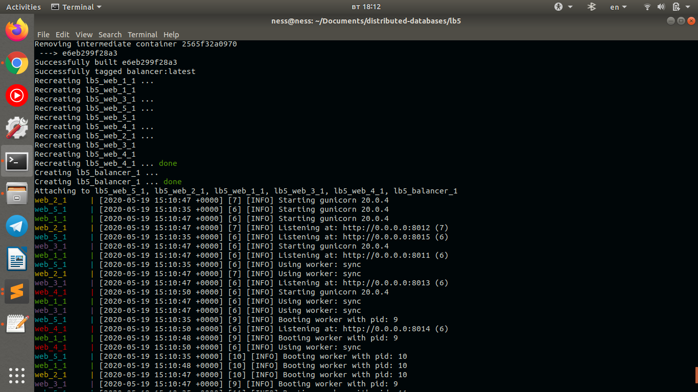

Скріншот з терміналу про виконання роботи 




# Виконане домашнє завдання, створити інфраструктуру із п'яти серверів, між якими відбувається масштабування навантаження.
### відповіді на контрольні запитання в кінці файлу

1. Що таке NGINX? Перелічіть області застосування NGINX.

NGINX - це HTTP-сервер і зворотній проксі-сервер, поштовий проксі-сервер, а також TCP / UDP проксі-сервер загального призначення. Уже тривалий час він обслуговує сервери багатьох високонавантажених сайтів.
У своєму первісному випуску воно функціонувало для веб-обслуговування HTTP. Однак сьогодні воно також служить зворотним проксі-сервером, балансувальник навантаження HTTP і поштовим проксі-сервером для IMAP, POP3 і SMTP.

2. Поясніть процес конфігурації NGINX.

Головний процес спочатку перевіряє синтаксичну правильність конфігурації, а потім намагається застосувати нову конфігурацію, тобто, відкрити лог-файли і нові listen сокети. Якщо йому це не вдається, то він відкочується зміни і продовжує працювати зі старою конфігурацією. Якщо ж вдається, то він запускає нові робочі процеси, а старим шле повідомлення про плавний вихід. Старі робочі процеси закривають listen сокети і продовжують обслуговувати старих клієнтів. Після обслуговування всіх клієнтів старі робочі процеси завершуються.
NGINX використовує контексти конфігурації, які описані в різних файлах конфігурації. Базовий файл nginx.conf.

Перше, що ви повинні помітити при перегляді основного файлу конфігурації, це те, що він виглядає організованим у вигляді дерева, визначеної наборами дужок (які виглядають як + {+ і +} +). Мовою Nginx області, які визначають ці дужки, називаються «контекстами», тому що вони містять деталі конфігурації, які розділені відповідно до галузі їх інтересів. По суті, ці підрозділи забезпечують організаційну структуру разом з деякою умовною логікою, щоб вирішити, чи застосовувати конфігурації всередині.

3. Що таке балансування навантаження? Перелічіть і поясніть методи балансування.

У термінології комп'ютерних мереж балансування навантаження або вирівнювання навантаження (англ. Load balancing) - метод розподілу завдань між декількома мережевими пристроями (наприклад, серверами) з метою оптимізації використання ресурсів, скорочення часу обслуговування запитів, горизонтального масштабування кластера (динамічне додавання / видалення пристроїв), а також забезпечення відмовостійкості (резервування).
Методи балансування:

* Round Robin
* Weighted Round Robin
* Least connections, weighted least connections
* Source IP hash
* Generic Hash
* Random

4. Поясніть конфігурацію NGINX для балансування навантаження.
```
http {
    upstream python-cluster {
        server 172.17.0.1:8011;
        server 172.17.0.1:8012;
        server 172.17.0.1:8013;
	    server 172.17.0.1:8014;
	    server 172.17.0.1:8015;
    }
    server {
        listen 80;

        location / {
            proxy_set_header X-Forwarded-For $proxy_add_x_forwarded_for;
            proxy_pass http://python-cluster;
        }
    }
}
events {
    worker_connections 1024;
}
```

